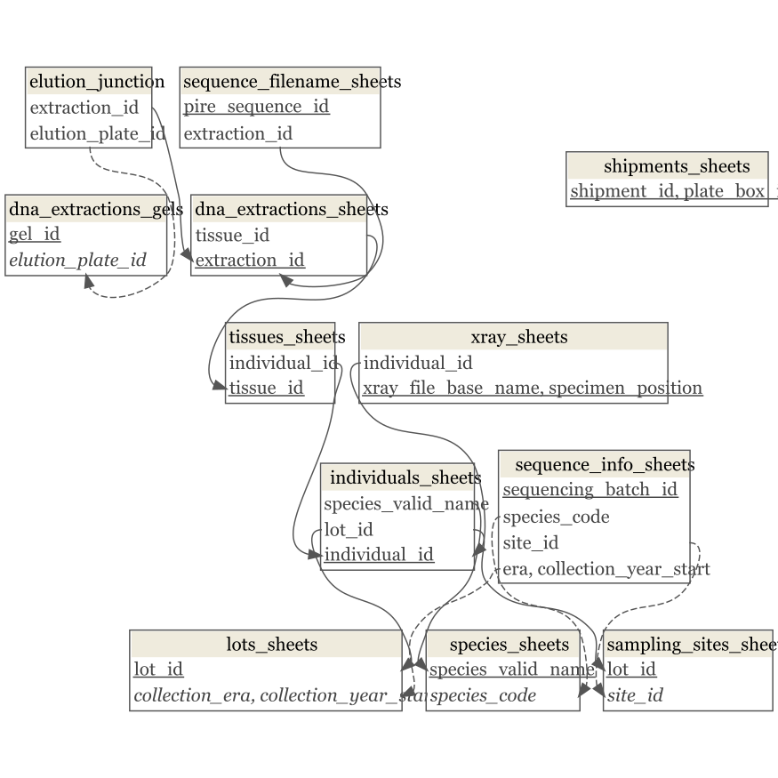

# database2.0: Albatross Recollections

---



---

## Basic Structure
* every data file is [tidy](https://cran.r-project.org/web/packages/tidyr/vignettes/tidy-data.html)
* each entity (table) in the databased is represented by a directory
  * The directory should be populated by one or more tsv files (no excel)
  * These files should be concatenatable using `bind_rows()`, i.e. they should have the same columns
* each entity (table) should follow a relational database structure
  * entities (tables) should be assembled in R as tibbles (dataframes)
  * `dm` should be used to create the database object

## Database Contents Structure
- [Extraction Sheets](db_files/dna_extractions_sheets/README.md)
- [Individual Sheets](db_files/individuals_sheets/README.md)
- [Lot Sheets](db_files/lots_sheets/README.md)
- [Sampling Sites Sheets](db_files/sampling_sites_sheets/README.md)
- [Sequence Sheets](db_files/sequence_info_sheets/README.md) **Unlinked to main DB**
- [Shipment Sheets](db_files/shipments_sheets/README.md) **Unlinked to main DB**
- [Species Sheets](db_files/shipments_sheets/README.md)
- [DNA Extraction Gels](db_files/dna_extractions_gels/README.md) **Unlinked to main DB**

## Quick Start 
Double click on `database_albatross_recollections.Rproj`
Run `get_database()` in R to access the database

## How to use this repo
This repository uses [renv](https://rstudio.github.io/renv/) to create a reproductible R environment. 


1. Clone this repository to your local machine by typing the following on the command line:
```bash
git clone git@github.com:philippinespire/database_albatross_recollections.git
```
2. Navigate to the database folder and open `database_albatross_recollections.Rproj` in `RStudio`. Something like the following should be shown in your console:
```r
============================================================
 PROJECT: database_albatross_recollections
============================================================

📁 Working directory confirmed
    C:/Users/jdsel/Documents/Google Drive/TAMUCC-CORE/PIRE/database_albatross_recollections 

🪟 Windows system detected
   ✔ Rtools detected

📦 Checking R environment...
   ✔ renv active
   ✅ All 154 R packages installed

------------------------------------------------------------
 ✅ PROJECT READY
 ┌─────────────────────────────────────────────────────┐
 💡 QUICK START:
    • Using the database?       Run: get_database()
    • Updating the database?    Run: update_database()
 └─────────────────────────────────────────────────────┘
```
If this message does not appear on your console, try sourcing the .Rprofile manually in the R console:
```r
# Ensure you are in the correct directory
>getwd()
# This should display the path to the albatross_recollections directory. If not, set the directory manually:
>setwd("/path/to/database_albatross_recollections")
# Source the .Rprofile
>source(".Rprofile")
```
Once the R profile is correctly running, you have access to new project specific R functions (see below) that can be used to locally build the database. Generally you should be able to follow the instructions in the terminal to set-up your computer if needed and use/update the database.

4. If this is the first time cloning the repo the R function `setup_project()` will be available. Use `setup_project()` in the R console to install needed packages and restart R (Session → Restart R or Ctrl+Shift+F10).
	- If you are using a Windows computer: If [RTools](https://cran.r-project.org/bin/windows/Rtools/) is not detected installed on your computer you will be prompted to use `install_windows_tools()` which will provide guidance on how to install Rtools prior to using `setup_project()`
	- If you are using a Linux computer: First use `setup_project()` to install packages. However if there are errors you can use `install_linux_dependencies()` to get a prompt for how to download linux system dependencies that may not come with your distro by default.
	- If you are using a Mac computer: 

5. To locally build the database, use the R function `get_database()` to create the database as a `dm` object. 

## Using the database
**Example 1: Counting the number of samples from a collection site**
```r
#Obtain distinct collection sites
pire_db <- get_database()
pull_tbl(pire_db, "individuals_sheets") %>%
  distinct(collection_site)
```
<details>
  <summary>Output</summary>

```r
# A tibble: 105 × 1
   collection_site   
   <chr>             
 1 Port_Dupon        
 2 Cebu_Market       
 3 Ragay_River       
 4 Pasacao           
 5 Pandanan_Id       
 6 Puerto_Galera     
 7 Port_Caltom       
 8 Guijulugan_Beach  
 9 Bais_Bay_Anchorage
10 Hamilo_Cove       
# ℹ 95 more rows
```
</details>
<br>

```r
#Find species collected at Hamilo Cove
pire_db <- get_database()
pull_tbl(pire_db, "individuals_sheets") %>%
  filter(collection_site == "Hamilo_Cove") %>%
  distinct(species_valid_name)
```

<details>
  <summary>Output</summary>

```r
# A tibble: 7 × 1
  species_valid_name         
  <chr>                      
1 Atherinomorus_duodecimalis 
2 Atherinomorus_endrachtensis
3 Ambassis_urotaenia         
4 Gazza_minuta               
5 Hypoatherina_temminckii    
6 Equulites_leuciscus        
7 Spratelloides_delicatulus  
```
</details>

<br>

```r
#Count individuals by species at Hamilo Cove
pire_db <- get_database()
pull_tbl(pire_db, "individuals_sheets") %>%
    filter(collection_site == "Hamilo_Cove") %>%
    count(species_valid_name, name = "n_individuals")
```
<details>
  <summary>Output</summary>

```r
# A tibble: 7 × 2
  species_valid_name          n_individuals
  <chr>                               <int>
1 Ambassis_urotaenia                     96
2 Atherinomorus_duodecimalis            192
3 Atherinomorus_endrachtensis            60
4 Equulites_leuciscus                    32
5 Gazza_minuta                           96
6 Hypoatherina_temminckii                96
7 Spratelloides_delicatulus              96
```
</details>
<br>

```r
#Count individuals by species and collection period at Hamilo Cove
pire_db <- get_database()
pull_tbl(pire_db, "individuals_sheets") %>%
  filter(collection_site == "Hamilo_Cove") %>%
  count(species_valid_name, collection_period, name = "n_individuals")
```

<details>
  <summary>Output</summary>

```r
# A tibble: 8 × 3
  species_valid_name          collection_period n_individuals
  <chr>                       <chr>                     <int>
1 Ambassis_urotaenia          Contemporary                 96
2 Atherinomorus_duodecimalis  Albatross                    96
3 Atherinomorus_duodecimalis  Contemporary                 96
4 Atherinomorus_endrachtensis Albatross                    60
5 Equulites_leuciscus         Albatross                    32
6 Gazza_minuta                Albatross                    96
7 Hypoatherina_temminckii     Contemporary                 96
8 Spratelloides_delicatulus   Contemporary                 96
```
</details>


## Adding Data to the Database
After cloning the repo locally:
* Add a new table to the relevant subdirectory in [`staging`](staging). Each folder contains an "EXAMPLE" file with the proper file header to use and a readme describing what the columns should contain. Be sure to use the exact same column names and cell formatting as the existing table in that directory. 
* Use an informative name of the format INITIALS-YEAR-MONTH-DAY-DESC.tsv, where you're using your initials, the 4-digit year, the 2-digit month, and a short description without any punctuation or spaces.
* Use the `update_database()` function (available after opening `database_albatross_recollections.Rproj`) which will validate the data being input and copy the files into the database
	- If there are problems with the data fix them as instructed by the error messages
* Push back to GitHub

### Troubleshooting

<details>
  <summary> MacOS gfortran installation issues </summary>
  If you are having issues installing packages due to gfortran related issues on Mac, try installing the latest version from https://mac.r-project.org/tools/.
</details>