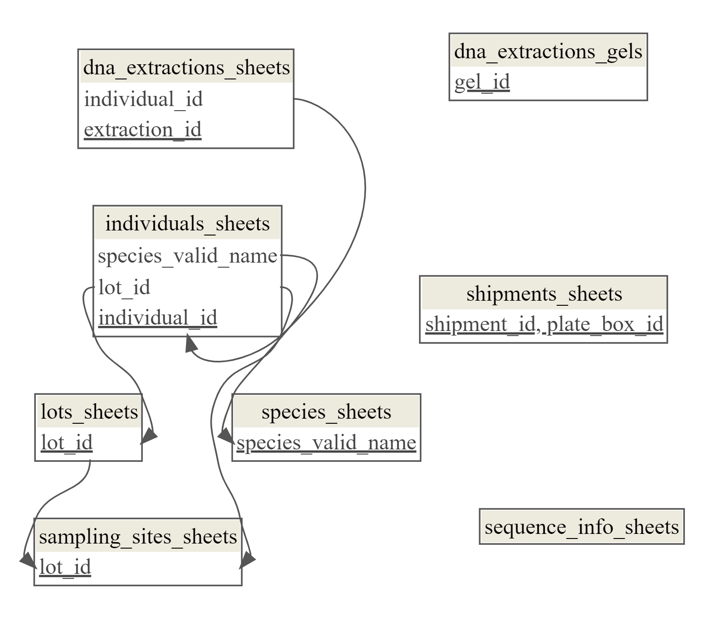

# database2.0: Albatross Recollections

---



---

## Basic Structure
* every data file is [tidy](https://cran.r-project.org/web/packages/tidyr/vignettes/tidy-data.html)
* each entity (table) in the databased is represented by a directory
  * The directory should be populated by one or more tsv files (no excel)
  * These files should be concatenatable using `bind_rows()`, i.e. they should have the same columns
* each entity (table) should follow a relational database structure
  * entities (tables) should be assembled in R as tibbles (dataframes)
  * `dm` should be used to create the database object
 
  * 

## How to use this repo
This repository uses [renv](https://rstudio.github.io/renv/) to create a reproductible R environment. 


1. Clone this repository to your local machine by typing the following on the command line:
```bash
git clone git@github.com:philippinespire/database_albatross_recollections.git
```
2. Navigate to the database folder and open `database_albatross_recollections.Rproj` in `RStudio`. Something like the following should be shown in your console:
```r
# Bootstrapping renv 1.1.2 ---------------------------------------------------
- Downloading renv ... OK
- Installing renv  ... OK

- Project 'C:/Users/jdsel/Downloads/database_albatross_recollections' loaded. [renv 1.1.2]
- One or more packages recorded in the lockfile are not installed.
- Use `renv::status()` for more details.

============================================================
 PROJECT: database_albatross_recollections
============================================================

⚠️  PACKAGES NEED TO BE INSTALLED
   Missing 144 packages

============================================================
 ACTION REQUIRED:
============================================================

 Run this command to install all required packages:

   renv::restore()

 This will take a few minutes on first setup.
 After installation, restart R (Session → Restart R)
============================================================

📌 Commands available:
   • setup_project()    - Install all packages (run this first!)
   • check_setup()      - Check project status
   • open_main_script() - Open main script (after setup)
```
If this message does not appear on your console, try sourcing the .Rprofile manually in the R console:
```r
# Ensure you are in the correct directory
>getwd()
# This should display the path to the albatross_recollections directory. If not, set the directory manually:
>setwd("/path/to/database_albatross_recollections")
# Source the .Rprofile
>source(".Rprofile")
```
Once the R profile is correctly running, you have access to new project specific R functions (see below) that can be used to locally build the database.

4. If this is the first time cloning the repo use the R function `setup_project()` in the R console to install needed packages and restart R (Session → Restart R or Ctrl+Shift+F10).

```r
# In the R console
>setup_project()
```

5. To locally build the database, use the R function `open_main_script()` to open [`scripts/assemble_db.R`](scripts/assemble_db.R) to interactively create the database as a `dm` object. Alternatively, open and run the lines in`scripts/assemble_db.R`.

```r
# In the R console
>open_main_script()
```


### Troubleshooting

<details>
  <summary> MacOS gfortran installation issues </summary>
  If you are having issues installing packages due to gfortran related issues on Mac, try installing the latest version from https://mac.r-project.org/tools/.
</details>

## How to use the database

## How to edit the database
After cloning the repo locally:
* Add a new table to the relevant subdirectory in `db_files`. Be sure to use the exact same column names and cell formatting as the existing table in that directory. 
* Use an informative name of the format INITIALS-YEAR-MONTH-DAY-DESC.tsv, where you're using your initials, the 4-digit year, the 2-digit month, and a short description without any punctuation or spaces.
* The database creation script reads in and row-binds all files in a given directory to create the relevant database tables.
* Check the [`scripts/assemble_db.R`](scripts/assemble_db.R) runs correctly with your new file
* Push back to GitHub
